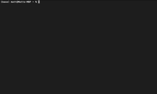

staleaudit-for-plex is a command-line tool that helps you identify stale and large content in your Plex library using watch-data from within Plex.

staleaudit-for-plex connects read-only to your Plex server's sqlite db and outputs a table containing:

- Items that are older than 18 months (by default)
- Items that haven't been watched in 18 months (by default)
- Sorted by size, descending

## Compare this project to ...

| Project    | Historical Awareness                                                                 | Interface      | Security                                                                                                                |
| ---------- | ------------------------------------------------------------------------------------ | -------------- | ----------------------------------------------------------------------------------------------------------------------- |
| [staleaudit-for-plex](https://github.com/pnwmatt/staleaudit-for-plex) | Watch history from 2021 onward, without reguard to when you first install staleaudit-for-plex | CLI only       | No running server, no api, no system-resources used when not running                                                    |
| [Tautilli](https://tautulli.com/)   | Only knows the watch history from the moment it's installed                          | Web UI and API | Must be running to keep track of activity. Needs network access from the plex server and an network interface to access |

## Project Status

Lightly tested on Mac and Windows

Not tested on Linux or BSD

## Installation and Updates

### ... via golang

```bash
go install github.com/pnwmatt/staleaudit-for-plex@latest
```

### ... download a release

Visit https://github.com/pnwmatt/staleaudit-for-plex/releases

## Usage

On the server running Plex, simply run the command:

```bash
staleaudit-for-plex
```

This will create/use a default config which is stored in your Plex Media Server folder.

Alternatively you can define the location of the config file with the `--config` flag:

```bash
staleaudit-for-plex --config=/path/to/config.json
```

Use the ARROW and ENTER keys on your keyboard to choose a library, and then the ARROW keys to scroll up/down.

USE CTRL-C or Q to exit.

This tool is READ ONLY, so now that you have the information, you can delete it from your Plex Library using the Plex UI (and consider removing it from your \*Arr or other tracker tool as well to avoid the content coming back).

## Configuration

By default when first ran, it will create a `staleaudit-for-plex.json` file with your settings in the Plex Media Server's folder:

- Windows: `%LOCALAPPDATA%\Plex Media Server`
- Mac: `~/Library/Application Support/Plex Media Server`
- Linux: `$PLEX_HOME/Library/Application Support/Plex Media Server`

| JSON Key                     | Description                                                   | Default Value                                                          |
| ---------------------------- | ------------------------------------------------------------- | ---------------------------------------------------------------------- |
| filter_created_before_months | Only show media created before this many months ago           | 18                                                                     |
| filter_last_streamed_months  | Only show media that hasn't been streamed in this many months | 18                                                                     |
| plex_db_path                 | Path to the Plex Media Server's sqlite database               | `(plex root)/Plug-in Support/Databases/com.plexapp.plugins.library.db` |
| language                     | Localization formatting for large numbers                     | `en`                                                                   |

## Roadmap
- [ ] View TV shows by season (90% done)
- [ ] Command to use *arr API and Plex API to remove content
- [ ] Add tags to content that prevent staleaudit from reporting that item
- [ ] Command to lower the bitrate for content to decrease filesize